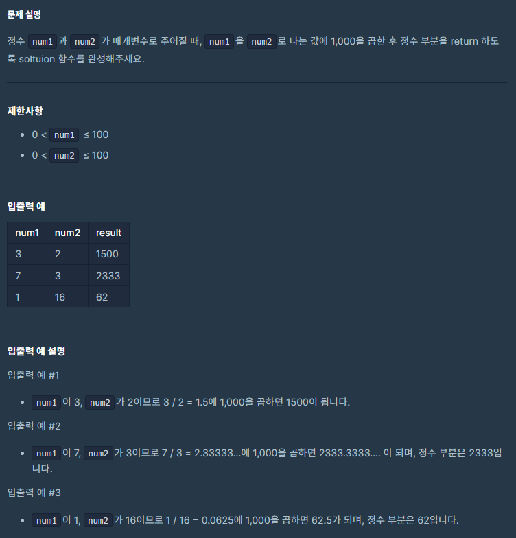
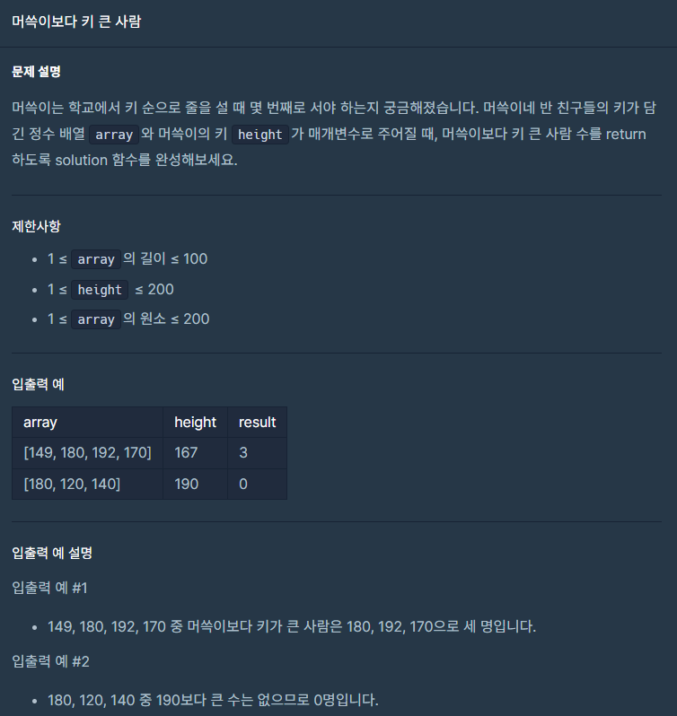

# 두수의 나눗셈



```js
function solution(num1, num2) {
    var answer = Math.floor((num1 / num2) * 1000);
    return answer;
}
```

# 머쓱이보다 키 큰 사람



```js
function solution([...array], height) {
    let s = 0;
    for (const i of array) {
        if (i > height) {
            s += 1;
        }
    }
    return s;
}
```
