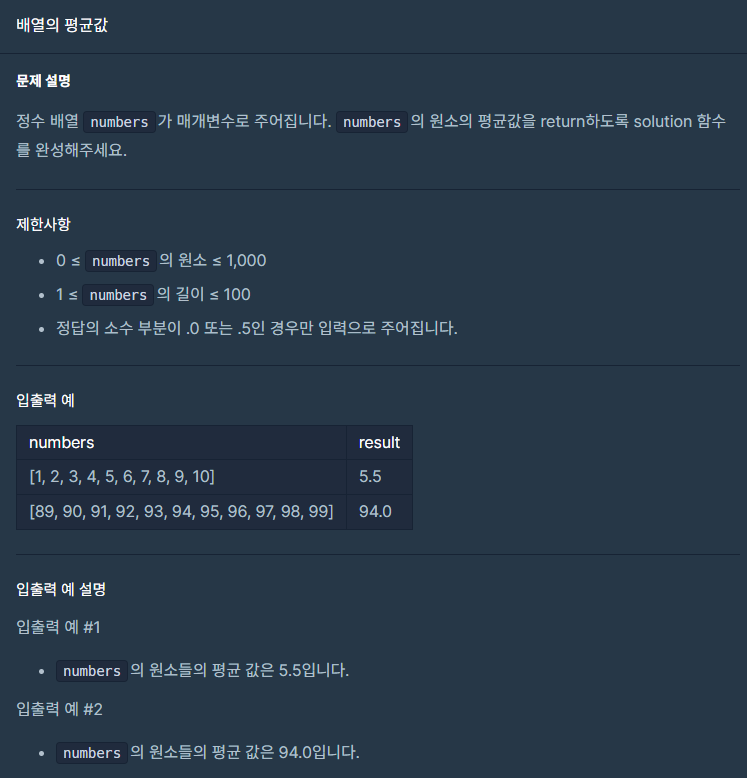

# 몫 구하기


```js
function solution(num1, num2) {
    var answer = Math.floor(num1 / num2);
    return answer;
}
```

# 두수의 합


```js
function solution(num1, num2) {
    var answer = num1 + num2;
    return answer;
}
```

# 나머지 구하기


```js
function solution(num1, num2) {
    var answer = num1 % num2;
    return answer;
}
```

# 나이 출력


```js
function solution(age) {
    var answer = 2023 - age;
    return answer;
}
```

# 숫자 비교하기


```js
function solution(num1, num2) {
    if (num1 === num2) {
        return 1;
    } else if (num1 !== num2) {
        return -1;
    }
}
```

# 각도기


```js
function solution(angle) {
    if (0 < angle && angle < 90) {
        return 1;
    } else if (angle === 90) {
        return 2;
    } else if (angle < 180) {
        return 3;
    } else if (angle === 180) {
        return 4;
    }
}
```

# 배열의 평균값



```js
function solution(numbers) {
    let s = 0;
    for (let i of numbers) {
        s += i / numbers.length;
    }
    return s;
}
```

# 짝수의 합


```js
function solution(n) {
    let sum = 0;
    for (let i = 0; i <= n; i++) {
        if (i % 2 === 0) {
            sum += i;
        }
    }
    return sum;
}
```
